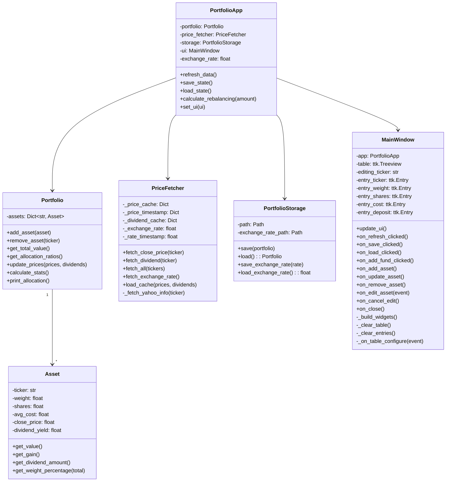

```mermaid
classDiagram
    class PortfolioApp {
        -portfolio: Portfolio
        -price_fetcher: PriceFetcher
        -storage: PortfolioStorage
        -ui: MainWindow
        -exchange_rate: float
        +refresh_data()
        +save_state()
        +load_state()
        +calculate_rebalancing(amount)
        +set_ui(ui)
    }
    class Portfolio {
        -assets: Dict~str, Asset~
        +add_asset(asset)
        +remove_asset(ticker)
        +get_total_value()
        +get_allocation_ratios()
        +update_prices(prices, dividends)
        +calculate_stats()
        +print_allocation()
    }
    class Asset {
        -ticker: str
        -weight: float
        -shares: float
        -avg_cost: float
        -close_price: float
        -dividend_yield: float
        +get_value()
        +get_gain()
        +get_dividend_amount()
        +get_weight_percentage(total)
    }
    class PriceFetcher {
        -_price_cache: Dict
        -_price_timestamp: Dict
        -_dividend_cache: Dict
        -_exchange_rate: float
        -_rate_timestamp: float
        +fetch_close_price(ticker)
        +fetch_dividend(ticker)
        +fetch_all(tickers)
        +fetch_exchange_rate()
        +load_cache(prices, dividends)
        -_fetch_yahoo_info(ticker)
    }
    class PortfolioStorage {
        -path: Path
        -exchange_rate_path: Path
        +save(portfolio)
        +load(): Portfolio
        +save_exchange_rate(rate)
        +load_exchange_rate(): float
    }
    class MainWindow {
        -app: PortfolioApp
        -table: ttk.Treeview
        -editing_ticker: str
        -entry_ticker: ttk.Entry
        -entry_weight: ttk.Entry
        -entry_shares: ttk.Entry
        -entry_cost: ttk.Entry
        -entry_deposit: ttk.Entry
        +update_ui()
        +on_refresh_clicked()
        +on_save_clicked()
        +on_load_clicked()
        +on_add_fund_clicked()
        +on_add_asset()
        +on_update_asset()
        +on_remove_asset()
        +on_edit_asset(event)
        +on_cancel_edit()
        +on_close()
        -_build_widgets()
        -_clear_table()
        -_clear_entries()
        -_on_table_configure(event)
    }
    PortfolioApp --> Portfolio
    PortfolioApp --> PriceFetcher
    PortfolioApp --> PortfolioStorage
    PortfolioApp --> MainWindow
    Portfolio "1" --> "*" Asset
```