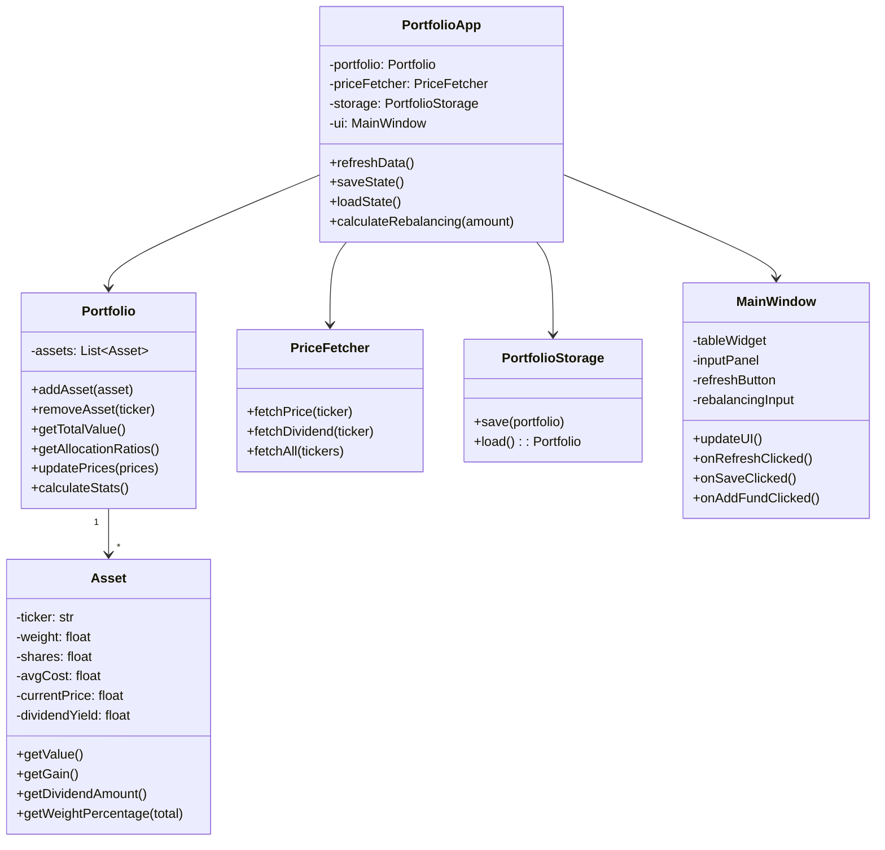

```mermaid
classDiagram
    class PortfolioApp {
        -portfolio: Portfolio
        -priceFetcher: PriceFetcher
        -storage: PortfolioStorage
        -ui: MainWindow
        +refreshData()
        +saveState()
        +loadState()
        +calculateRebalancing(amount)
    }
    class Portfolio {
        -assets: List~Asset~
        +addAsset(asset)
        +removeAsset(ticker)
        +getTotalValue()
        +getAllocationRatios()
        +updatePrices(prices)
        +calculateStats()
    }
    class Asset {
        -ticker: str
        -weight: float
        -shares: float
        -avgCost: float
        -currentPrice: float
        -dividendYield: float
        +getValue()
        +getGain()
        +getDividendAmount()
        +getWeightPercentage(total)
    }
    class PriceFetcher {
        +fetchPrice(ticker)
        +fetchDividend(ticker)
        +fetchAll(tickers)
    }
    class PortfolioStorage {
        +save(portfolio)
        +load(): Portfolio
    }
    class MainWindow {
        -tableWidget
        -inputPanel
        -refreshButton
        -rebalancingInput
        +updateUI()
        +onRefreshClicked()
        +onSaveClicked()
        +onAddFundClicked()
    }
    PortfolioApp --> Portfolio
    PortfolioApp --> PriceFetcher
    PortfolioApp --> PortfolioStorage
    PortfolioApp --> MainWindow
    Portfolio "1" --> "*" Asset
```
