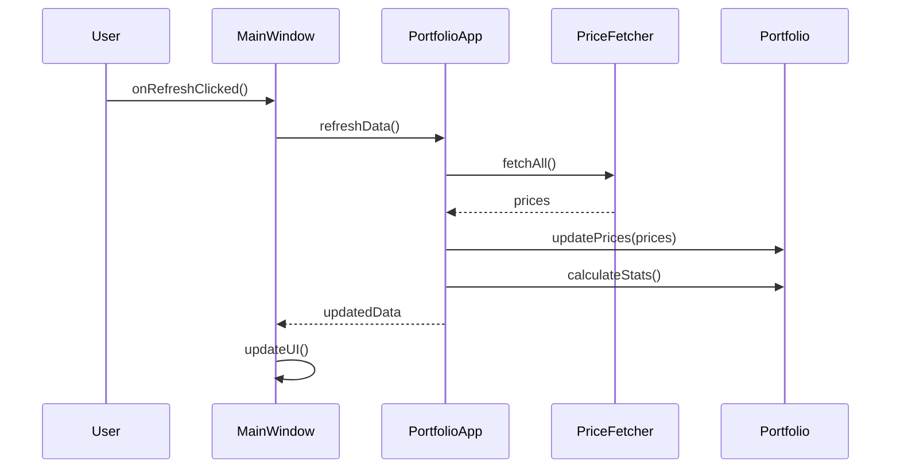

```mermaid
sequenceDiagram
    participant User
    participant MainWindow
    participant PortfolioApp
    participant PriceFetcher
    participant Portfolio

    User->>MainWindow: onRefreshClicked()
    MainWindow->>PortfolioApp: refreshData()
    PortfolioApp->>PriceFetcher: fetchAll()
    PriceFetcher-->>PortfolioApp: prices
    PortfolioApp->>Portfolio: updatePrices(prices)
    PortfolioApp->>Portfolio: calculateStats()
    PortfolioApp-->>MainWindow: updatedData
    MainWindow->>MainWindow: updateUI()
```
