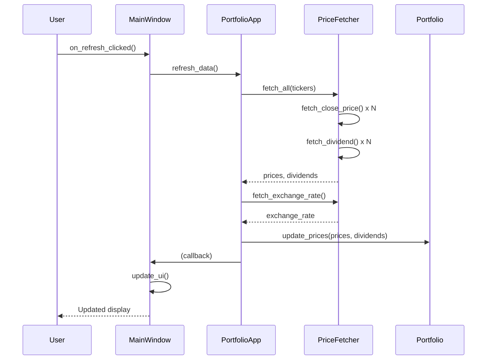

```mermaid
sequenceDiagram
    participant User
    participant MainWindow
    participant PortfolioApp
    participant PriceFetcher
    participant Portfolio

    User->>MainWindow: on_refresh_clicked()
    MainWindow->>PortfolioApp: refresh_data()
    PortfolioApp->>PriceFetcher: fetch_all(tickers)
    PriceFetcher->>PriceFetcher: fetch_close_price() x N
    PriceFetcher->>PriceFetcher: fetch_dividend() x N
    PriceFetcher-->>PortfolioApp: prices, dividends
    PortfolioApp->>PriceFetcher: fetch_exchange_rate()
    PriceFetcher-->>PortfolioApp: exchange_rate
    PortfolioApp->>Portfolio: update_prices(prices, dividends)
    PortfolioApp->>MainWindow: (callback)
    MainWindow->>MainWindow: update_ui()
    MainWindow-->>User: Updated display
```