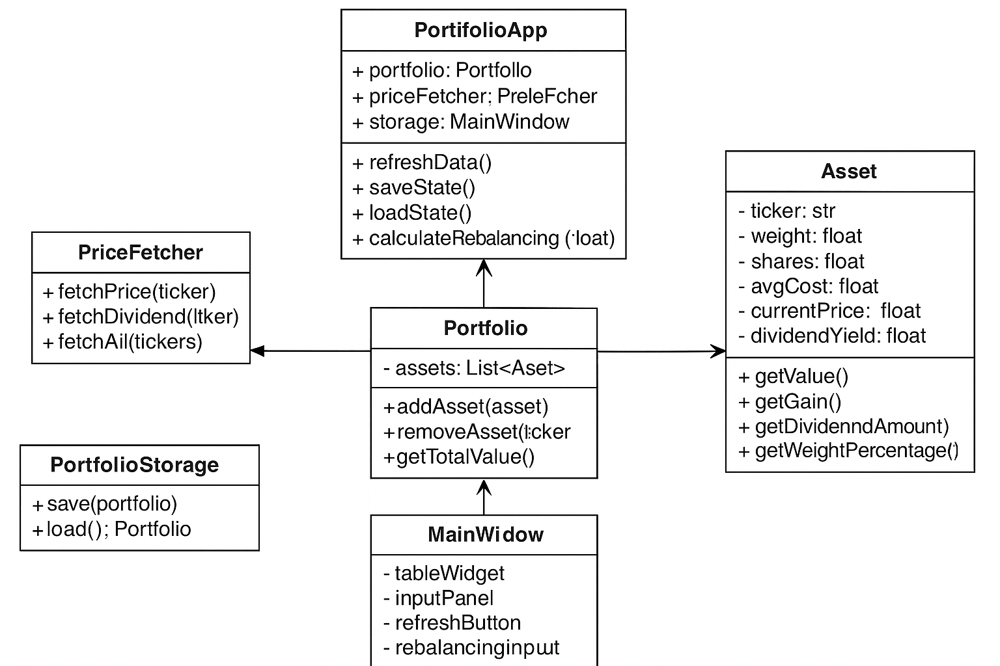

# 논리 뷰 (Logical View)

이 문서는 시스템의 클래스 및 객체 구조를 정의합니다.

## 주요 클래스 및 관계

- **PortfolioApp**  
  - portfolio: Portfolio  
  - priceFetcher: PriceFetcher  
  - storage: PortfolioStorage  
  - ui: MainWindow  
  - 메서드: refreshData(), saveState(), loadState(), calculateRebalancing(amount)

- **Portfolio**  
  - assets: List[Asset]  
  - 메서드: addAsset(), removeAsset(), getTotalValue(), getAllocationRatios(), updatePrices(), calculateStats()

- **Asset**
  - ticker, weight, shares, avgCost, closePrice, dividendYield
  - 메서드: getValue(), getGain(), getDividendAmount(), getWeightPercentage(total)

- **PriceFetcher**
  - 메서드: fetchClosePrice(), fetchDividend(), fetchAll()

- **PortfolioStorage**  
  - 메서드: save(), load()

- **MainWindow**  
  - UI 컴포넌트 및 이벤트 핸들러 (onRefreshClicked, onSaveClicked, onAddFundClicked)
